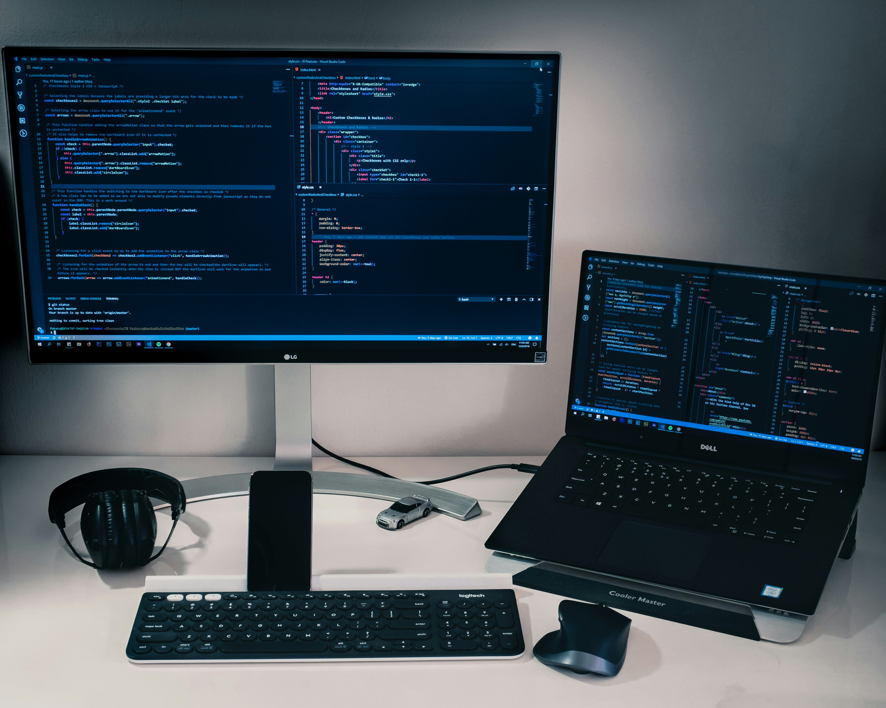

# 3D Portfolio Website

A professional and modern 3D portfolio website that showcases skills in programming, software engineering, artificial intelligence, and robotics. This interactive experience combines attractive design with expressive, personal content.


## Live Demo

Visit the live website: [https://haroun-educ.github.io/portfolio3d/](https://haroun-educ.github.io/portfolio3d/)

## 📅 Project Timeline

- **Idea Date**: `13 January 2025`  
- **First Commit**: `27 April 2025`  
- **Latest Public Updates**: `12 May 2025`  
- **Ongoing**: Minor improvements and optimizations are added from time to time

## Features

- **Interactive 3D Elements**: Engaging 3D planet model with dynamic animations using Three.js
- **Modern Design**: Clean and professional UI with Tailwind CSS and glass-effect components
- **Smooth Animations**: Fluid transitions and effects with Framer Motion
- **Responsive Layout**: Optimized for all devices from mobile to desktop
- **Dark Mode**: Toggle between light and dark themes with preference saving
- **Bilingual Support**: Switch between English and French with preference saving
- **SEO Optimized**: Enhanced meta tags and Open Graph support for better search visibility
- **Performance Optimized**: Improved loading times and rendering performance
- **Functional Contact Form**: Working contact form with validation and feedback
- **Downloadable Resume**: Option to view and download CV in PDF format

## Tech Stack

- **Frontend Framework**: React
- **3D Graphics**: Three.js, React Three Fiber, Drei
- **Styling**: Tailwind CSS
- **Animations**: Framer Motion
- **Routing**: React Router
- **Build Tool**: Vite
- **Deployment**: GitHub Pages

## Sections

- **Home**: Eye-catching 3D animation with a brief introduction
- **About**: Personal background, education, and interests
- **Skills**: Visual representation of technical skills
- **Projects**: Showcase of important projects
- **Achievements**: Competitions, certifications, and awards
- **Contact**: Contact form and social media links

## Getting Started

### Prerequisites

- Node.js (v14 or higher)
- npm or yarn

### Installation

1. Clone the repository:
   ```bash
   git clone https://github.com/Haroun-educ/portfolio3d.git
   cd portfolio
   ```

2. Install dependencies:
   ```bash
   npm install
   ```

3. Start the development server:
   ```bash
   npm run dev
   ```

4. Open your browser and visit `http://localhost:5173`

### Building for Production

```bash
npm run build
```

### Deploying to GitHub Pages

The project is configured to deploy automatically to GitHub Pages using GitHub Actions. Just push your changes to the main branch, and the workflow will handle the deployment.

## Customization

- Update personal information in the page components
- Replace placeholder images with your own
- Add your own 3D models in the `src/models` directory
- Modify colors and styling in the Tailwind configuration

## Performance Optimization

### Recent Improvements
The portfolio has been optimized with several performance enhancements:

1. **SEO Optimization**
   - Added comprehensive meta tags for better search engine visibility
   - Implemented Open Graph tags for improved social media sharing
   - Added Twitter Card support
   - Included canonical URL to prevent duplicate content issues

2. **Performance Enhancements**
   - Optimized image loading with proper sizing and compression
   - Improved 3D model rendering with optimized geometries and materials
   - Added loading states and skeleton screens for better perceived performance
   - Implemented debounce functions for performance-intensive operations

3. **User Experience Improvements**
   - Added preference saving for dark mode and language settings
   - Enhanced navigation with smooth scrolling and URL hash updates
   - Improved form validation and feedback for the contact form
   - Added glass-effect UI components for a modern look

### Image Optimization
For better performance, especially on mobile devices:

1. Compress all images before adding them to the project
   - Use tools like [TinyPNG](https://tinypng.com/) or [Squoosh](https://squoosh.app/)
   - Aim for image sizes under 200KB when possible
   - Use WebP format instead of JPG/PNG for better compression

2. Use appropriate image dimensions
   - Don't use images larger than needed for their display size
   - Consider creating different sizes for different devices

### 3D Performance
The 3D elements can be resource-intensive on mobile devices:

1. The site automatically shows a simplified version on mobile devices
2. For further optimization, you can:
   - Reduce polygon count in 3D models
   - Use simpler materials
   - Implement level-of-detail (LOD) for complex scenes

3. Current optimizations include:
   - Memory-efficient rendering with useRef and useMemo hooks
   - Optimized lighting and shadows
   - Reduced geometry complexity for better mobile performance

## Screenshots

### Home Page with 3D Planet


### Projects Section


### Skills Section


## License

This project is licensed under the MIT License - see the LICENSE file for details.

## Author

**Mohamed Haroun Kaida** - Student & Technology Enthusiast

- GitHub: [Haroun-educ](https://github.com/Haroun-educ)
- LinkedIn: [Mohamed Haroun Kaida](https://www.linkedin.com/in/haroun-educ/)
- Linktree: [Harouneduc](https://linktr.ee/Harouneduc)
